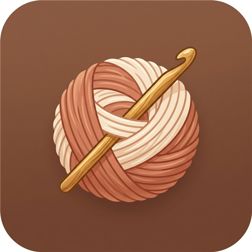
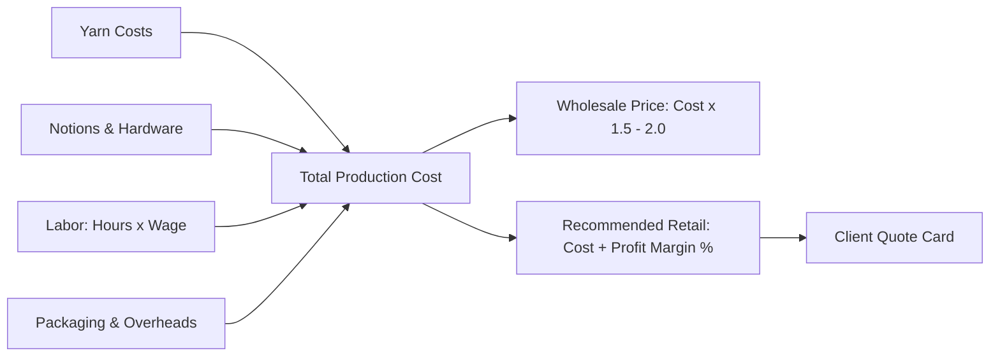

# 🧶 StitchCraft — The Ultimate Crochet Studio & Fair-Price Calculator
> ### *Solving the #1 problem every crocheteer faces: Never undercharge for your handmade art again.*

[](https://bhavya121013.github.io/Crochet-Website/)
[](https://bhavya121013.github.io/Crochet-Website/)
[](https://bhavya121013.github.io/Crochet-Website/)
[](LICENSE)

<div align="center">
  
  <br><br>
  <strong>A modern, offline-first Android Progressive Web Application (PWA) and Craft Studio designed to calculate accurate pricing, track multi-yarn skeins, protect your artisan wage, and generate instant client quote cards.</strong>
</div>

---

## 📖 Table of Contents
- [🚨 The Problem Every Crocheteer Faces](#-the-problem-every-crocheteer-faces)
- [✨ The Solution: StitchCraft](#-the-solution-stitchcraft)
- [📱 Android Application & 1-Click Install](#-android-application--1-click-install)
- [📐 The Golden Craft Pricing Formula](#-the-golden-craft-pricing-formula)
- [⚡ Key Features Showcase](#-key-features-showcase)
- [🪝 Crochet Reference & Hook Conversion](#-crochet-reference--hook-conversion)
- [🚀 Quick Start & Local Setup](#-quick-start--local-setup)
- [🌐 Enabling Free Hosting on GitHub Pages](#-enabling-free-hosting-on-github-pages)
- [👩‍🎨 Author & Credits](#-author--credits)

---

## 🚨 The Problem Every Crocheteer Faces

Did you know that **knitting can be replicated by machines, but crochet CANNOT?** 

Every single crochet stitch that exists on Earth — whether sold in an independent maker's boutique or on a fast-fashion shelf — was crafted by human hands holding a hook.

Yet, nearly every crochet artisan falls into the exact same traps:

1. **The $15 Trap:** Spending 12 hours lovingly hand-stitching an amigurumi plushie or bucket hat, and selling it for $20. You end up earning less than $1.20 an hour.
2. **The "Cost × 3" Myth:** Beginners are told to multiply their materials cost by 3. But if a doll takes $4 of yarn and 15 hours of delicate handwork, selling it for $12 means working for pennies.
3. **Hidden Leakage:** Forgetting to track partial yarn skeins, polyfill stuffing, safety eyes, stitch markers, tissue paper, mailer boxes, and Etsy's 6.5% transaction commission.
4. **Fear of Quoting:** Struggling to send prices to potential clients on Instagram or WhatsApp DMs without feeling guilty or apologetic.

> 💡 **StitchCraft was created to end craft exploitation once and for all.** It gives you the confidence, clarity, and mathematical rigor to charge what your time and talent are truly worth.

---

## ✨ The Solution: StitchCraft

StitchCraft turns guesswork into instant financial intelligence:

| What Crocheteers Used to Do | What StitchCraft Does |
| :--- | :--- |
| Guessing yarn cost from a half-used ball | **Dynamic Multi-Yarn Tracker:** Calculates exact cost down to the gram across multiple colors |
| Forgetting eyes, stuffing, buttons | **Notions Checklist:** Itemizes polyfill, hardware, and accessories |
| Working for free | **Fair Hourly Wage Engine:** Protects your time with real-time wage compensation |
| Eating platform fees | **Platform Buffer:** Automatically adds Etsy/Shopify transaction margins |
| Calculating prices manually for DMs | **Instant Quote Cards:** Generates professional client breakdown cards with 1-click copy |
| Needing Wi-Fi at craft markets | **100% Offline Android App:** Works directly at outdoor pop-ups and craft fairs |

---

## 📱 Android Application & 1-Click Install

StitchCraft is engineered as a **Progressive Web App (PWA)** with a native Android install experience.

### 📲 Automatic Android Popup
When opened in Chrome on any Android smartphone, StitchCraft automatically recognizes the device and presents an **"Install StitchCraft to Android"** dialog:

1. Tap **"Install to Android Now"**.
2. Chrome confirms the addition to your home screen.
3. StitchCraft now launches in **full-screen standalone mode** — no browser address bar, complete with its own home screen icon and offline cache!

### 🛠️ Manual Android / iOS Install Instructions
If the popup is closed or you are on desktop/iOS:
- **On Android (Chrome):** Tap the three dots (**⋮**) in the top-right corner ➔ Tap **"Install app"** or **"Add to Home screen"**.
- **On iPhone (Safari):** Tap the Share icon (**⎋**) ➔ Tap **"Add to Home Screen"**.
- **On Desktop (Chrome/Edge):** Click the install badge (**⊕**) in the browser address bar or the **"📲 Install App"** button in StitchCraft's navigation bar.

---

## 📐 The Golden Craft Pricing Formula

StitchCraft implements the internationally recognized artisan craft pricing standard:



### 1. Base Cost of Production:
$$\text{Production Cost} = \sum\left(\frac{\text{Grams Used}}{\text{Skein Weight}} \times \text{Skein Price}\right) + \text{Notions} + (\text{Hours} \times \text{Hourly Rate}) + \text{Packaging} + \text{Overhead}$$

### 2. Wholesale vs. Boutique Retail:
- **Wholesale Price:** $\text{Production Cost} \times 1.5\text{ to }2.0$ *(For consignment shops and gift stores)*
- **Recommended Retail:** $\text{Production Cost} + \text{Profit Margin } (\%)$, adjusted for platform commission fees.
- **Golden Craft Retail:** $\text{Wholesale} \times 2$ *(Industry standard for high-end artisan craft markets)*

---

## ⚡ Key Features Showcase

- 🎨 **Warm Artisan Design System:** Built with an earthy oatmeal, terracotta, sage green, and honey palette with glassmorphism and tactile micro-animations.
- 🌙 **Cozy Twilight Mode:** A dedicated dark theme designed for late-night crocheting by lamp light.
- 🧮 **Multi-Yarn Colorway Tracker:** Add unlimited yarns with individual skein sizes, grams used, and prices.
- ⏱️ **Interactive Time Steppers:** Tap `+15m`, `+30m`, or `+1h` with fair wage suggestions.
- 📊 **Real-Time Stacked Proportion Bar:** Visually see what percentage of your final price is Yarn vs. Labor vs. Profit.
- 🧸 **One-Click Presets:** Instant loading for Amigurumi, Granny Square Cardigans, Market Totes, Bucket Hats, Coasters, and Scrunchies.
- 💾 **Local Project Vault:** Save, organize, and reload quotes anytime without needing an account.
- 🧾 **Client Quote Card Modal:** Prepares clean quote summaries ready to print or copy directly to WhatsApp and Instagram DMs.

---

## 🪝 Crochet Reference & Hook Conversion

StitchCraft includes an integrated reference guide right in the app:

| Metric (mm) | US Letter | UK / Canadian | Common Yarn Pairing |
| :---: | :---: | :---: | :--- |
| **2.25 mm** | B-1 | 13 | Lace / Fingering (Amigurumi tight stitch) |
| **2.75 mm** | C-2 | 12 | Fingering / Sport |
| **3.50 mm** | E-4 | 9 | DK / Light Worsted |
| **4.00 mm** | G-6 | 8 | Worsted / Aran (Most popular) |
| **5.00 mm** | H-8 | 6 | Worsted / Heavy Aran |
| **6.00 mm** | J-10 | 4 | Chunky / Bulky |
| **8.00 mm** | L-11 | 0 | Super Bulky / Chenille Plushies |
| **10.00 mm** | N/P-15 | 000 | Jumbo Blankets & Rugs |

---

## 🚀 Quick Start & Local Setup

StitchCraft requires **no complex build tools or dependencies**. It runs natively in any modern web browser.

1. Clone or download this repository:
   ```bash
   git clone https://github.com/Bhavya121013/Crochet-Website.git
   cd Crochet-Website
   ```
2. Open `index.html` in your favorite web browser (Chrome, Edge, Firefox, Safari).
3. That's it! All calculations, storage, and PWA capabilities work directly out of the box.

---

## 🌐 Enabling Free Hosting on GitHub Pages

You can host StitchCraft online for free so anyone can use your app:

1. Go to your repository on GitHub: [`Bhavya121013/Crochet-Website`](https://github.com/Bhavya121013/Crochet-Website).
2. Click on **Settings** ➔ **Pages** (under the "Code and automation" section).
3. Under **Build and deployment** ➔ **Source**, select **"Deploy from a branch"**.
4. Choose Branch: **`main`** and folder: **`/ (root)`**.
5. Click **Save**.
6. Within 1-2 minutes, your live site will be active at:
   👉 **`https://bhavya121013.github.io/Crochet-Website/`**

---

## 👩‍🎨 Author & Credits

Designed and developed with love for the global handmade artisan community by **Bhavya Agarwal**.

- **GitHub:** [@Bhavya121013](https://github.com/Bhavya121013)
- **Repository:** [Crochet-Website](https://github.com/Bhavya121013/Crochet-Website)

---

<div align="center">
  <sub>✨ "Every stitch is made with love. Make sure every stitch is valued." ✨</sub>
</div>
